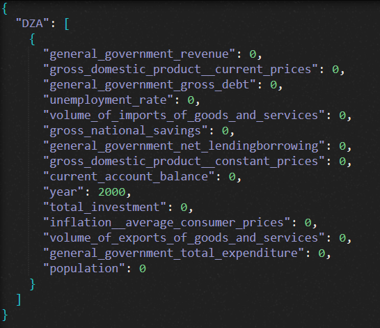
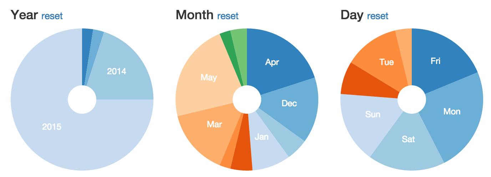
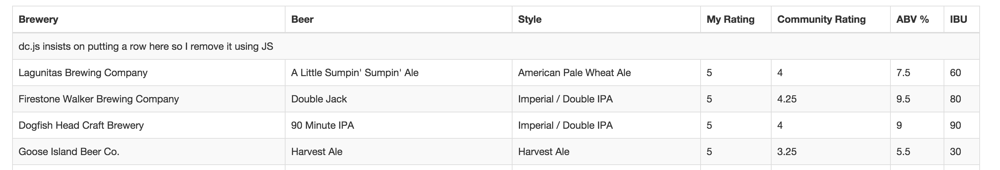

# IMF World Map Data
Using DataMaps, Crossfilter, dc.js, d3.js, Bootstrap.
This project is built on top of user [Austin Lyons](https://github.com/austinlyons/dcjs-leaflet-untappd)'s Beer Drinking project. He has a better explanations of how things work. 

# Demo
Try out the demo [here](https://imfdash.000webhostapp.com)

[](https://catdintran.github.io/imfdash)

# Tutorial
This dashboard is a product of my presentation of my college's data science course. This tutorial will provide steps to recreate a similar dashboard, buy you will need to provide your own data to show graphs or clone this to make an identical dashboard.


## Tools
As any others front-end products, HTML/CSS are the backbone to position and to style the interface. To save time, [Bootstrap]() is used to leverage existing stylesheets and methodology.

[dc.js]() is for interactive charts and corresponding table. [d3.js]() is a great data manipulation and graphic tool.

[crossfilter]() is a data management tool and works well with dc and d3. 

[DataMaps]() is a map projection(US-50 states, worlds), built on top of d3. However, it is missing some countries on the map.  


## Data
To simplify code, data has been coverted to json format and stored as var in 2 .js files:  ~/static/js/imf_anal.js, ~/static/js/dataMap_color.js

Format of the json file look like this:

]

Meaning: country codes 'DZA' in 'year' : 2000, has all these key elements to generate dc.js statistics graphs.


## HTML & Layout
```html
<div class="container-fluid">
  <!-- row 1 -->
  <div class="row" id="control-row">
	 <div class="col-xs-6 col-md-6">	    
            <!-- Graph 1 --> 
             <div class="col-xs-3 col-md-6">
             </div>	             
              <!-- Graph 2 --> 
             <div class="col-xs-3 col-md-4">            
             </div>     
	 </div>     
    		<!-- Map -->  
    <div class="col-xs-6 col-md-6" >	               
    </div>	    
  </div>
  <!-- row 2 -->
  <div class="row">
             <!-- Graph 3 -->
              <div class="col-xs-3 col-md-3">		
             </div>
              <!-- Graph 4 -->
              <div class="col-xs-3 col-md-3">
              </div>
	  <!-- countryName -->
	  <div  class="col-xs-6">
	  </div>
               <!-- Panel 1 -->
	  <div class="col-sm-3">
      		  <div class="chart-wrapper">
      		  </div>
		  <div class="chart-stage" style="color:#FFFFFF; background-color: #3F4C59;">         
	  </div>
	  </div>
	<!-- Panel 2 -->
      <div class="col-sm-3">
     		  <div class="chart-wrapper">
         	  </div>
		  <div class="chart-stage" style="color:#FFFFFF; background-color: #3F4C59;">         
          </div>
	  </div>           
</div> 
```
## JavaScript
Download all external .js libraries to your directory to ensure a stable performance for your webapp.

```javascript
<script type="text/javascript" src="js/d3.js"></script>
<script type="text/javascript" src="js/crossfilter.js"></script>
<script type="text/javascript" src="js/dc.js"></script>
<script type="text/javascript" src="js/leaflet.js"></script>
<script type="text/javascript" src="js/underscore-min.js"></script>
<script type="text/javascript" src="js/datamaps.world.min.jss"></script>
<script type="text/javascript">
```

## Architecture
The structure of this webapp can be broken down into 2 parts: the world map && the graphs.

 + *The world* is generated by built-in data from DataMaps and it is acting as the handler in this webapp. OnClick to a country will return the country's ISO3 code, this code will be pass to dc.js for graphs. 
 
 + *The graphs* will receive country ISO3 from DataMaps to poll data and project graphs.

### DataMaps
We begin by reading all of the JSON data from `untappd.json` using [`d3.json`](https://github.com/mbostock/d3/wiki/Requests#d3_json).
Before setting up any of the charting code, we preprocess the data we've
read so that it's in the format dc.js expects. We convert string
representation of numbers into actual numbers using the `+` operator
like this `d.count = +d.count`. We also round particular pieces of data
to the nearest 0.25, 0.5, or 10 to make the bar charts look better;
we are basically forcing the data into bins of a particular width. 
Finally, we use `d3.time.format` to pluck the values we care about (month,
day, etc) out of JavaScript Date objects.

```javascript
d3.json('untappd.json', function (error, data) {
  var beerData = data.response.beers.items;

  var fullDateFormat = d3.time.format('%a, %d %b %Y %X %Z');
  var yearFormat = d3.time.format('%Y');
  var monthFormat = d3.time.format('%b');
  var dayOfWeekFormat = d3.time.format('%a');

  // normalize/parse data so dc can correctly sort & bin them
  beerData.forEach(function(d) {
    d.count = +d.count;
    // round to nearest 0.25
    d.rating_score = Math.round(+d.rating_score * 4) / 4;
    d.beer.rating_score = Math.round(+d.beer.rating_score *4) / 4;
    // round to nearest 0.5
    d.beer.beer_abv = Math.round(+d.beer.beer_abv * 2) / 2;
    // round to nearest 10
    d.beer.beer_ibu = Math.floor(+d.beer.beer_ibu / 10) * 10;
    d.first_had_dt = fullDateFormat.parse(d.first_had);
    d.first_had_year = +yearFormat(d.first_had_dt);
    d.first_had_month = monthFormat(d.first_had_dt);
    d.first_had_day = dayOfWeekFormat(d.first_had_dt);
  });
```

### Crossfilter
[Crossfilter](http://square.github.io/crossfilter/) is the workhorse of the visualization. It does all of the grouping, aggregating, and filtering for us
and it does it all very quickly.
[Here's a nice
introduction](http://blog.rusty.io/2012/09/17/crossfilter-tutorial/) to bring you up to speed.

Now that we've cleaned up our data, we instantiate crossfilter and give
it our data.

```javascript
var ndx = crossfilter(beerData);
```

#### Dimensions
Next, we'll set up all of the
[dimensions](https://github.com/square/crossfilter/wiki/API-Reference#dimension). 
I think of these in my head as a list of x-axis values

```javascript
var yearDim  = ndx.dimension(function(d) {return d.first_had_year;}),
    // dc.pluck: short-hand for same kind of anonymous function we used for yearDim
    monthDim  = ndx.dimension(dc.pluck('first_had_month')),
    dayOfWeekDim = ndx.dimension(dc.pluck('first_had_day')),
    ratingDim = ndx.dimension(dc.pluck('rating_score')),
    commRatingDim = ndx.dimension(function(d) {return d.beer.rating_score;}),
    abvDim = ndx.dimension(function(d) {return d.beer.beer_abv;}),
    ibuDim = ndx.dimension(function(d) {return d.beer.beer_ibu;}),
    allDim = ndx.dimension(function(d) {return d;});
```

Take the rating dimension as an example. When we use this dimension to
create the chart, what we're doing is saying 
"for every item in our beer data, return the rating score as the x value
for this particular dimension". Notice that dc has a function `pluck` to make
this less verbose. 

Now how to get the corresponding y-values for each dimension?

#### Groups
[Groups](https://github.com/square/crossfilter/wiki/API-Reference#group-map-reduce) take
a dimension value as input and return an output value; they are the
mechanism by which you get a y-value for a particular x-value. If you're 
familiar with the map-reduce programming paradigm, that's what this
basically is. 

For each dimension in this simple visualization we are just plotting the number
of occurences on the y-axis, i.e. the number of 8% ABV beers I've had.
Counting the number of occurences is a very common thing to do so 
crossfilter has a built in function we'll use called `reduceCount`.


```javascript
  var all = ndx.groupAll();
  var countPerYear = yearDim.group().reduceCount(),
      countPerMonth = monthDim.group().reduceCount(),
      countPerDay = dayOfWeekDim.group().reduceCount(),
      countPerRating = ratingDim.group().reduceCount(),
      countPerCommRating = commRatingDim.group().reduceCount(),
      countPerABV = abvDim.group().reduceCount(),
      countPerIBU = ibuDim.group().reduceCount();
```

`reduceCount` is actually just a shorthand for the more flexible `reduce`.
`reduce` takes three parameters that tell crossfilter what to do whenever the group
is filtered. Specifically, what to do when data is added, removed, and
when the group is initialized.  A concrete example - in the ABV chart, 
if you zoom in to see only the 8% ABV beers, the crossfilter group 
needs to know how to remove the 5%, 6%, 7%, 9%, ... values. 

So using `reduce`, we would implement `countPerABV` as follows:

```javascript
var countPerABV = abvDim.group().reduce(
  function reduceAdd(p, v) {
    return p + 1;
  },
  function reduceRemove(p, v) {
    return p - 1;
  },
  function reduceInitial() {
    return 0;
  }
);
```

See the [annotated source](https://dc-js.github.io/dc.js/docs/stock.html#section-11)
 of dc.js' canonical example for advanced usage of `reduce`.

If you want to compute any functions for a particular dimension like mean or 
[standard deviation](https://en.wikipedia.org/wiki/Algorithms_for_calculating_variance#Computing_shifted_data),
 you would need to use this reduce pattern. Or you could just use
[Reductio](https://github.com/esjewett/reductio), a library that makes
Crossfilter grouping easier and comes with implementations for common grouping
functions like standard deviation.

### Charts
The first thing we'll do is create all of the dc chart objects.
As we instantiate each chart object we'll pass in the CSS selector
of the corresponding HTML element that the chart will be drawn in.

```javascript
var yearChart   = dc.pieChart('#chart-ring-year'),
    monthChart   = dc.pieChart('#chart-ring-month'),
    dayChart   = dc.pieChart('#chart-ring-day'),
    ratingCountChart  = dc.barChart('#chart-rating-count'),
    commRatingCountChart  = dc.barChart('#chart-community-rating-count'),
    abvCountChart  = dc.barChart('#chart-abv-count'),
    ibuCountChart  = dc.barChart('#chart-ibu-count'),
    dataCount = dc.dataCount('#data-count')
    dataTable = dc.dataTable('#data-table');
```

Now we'll start configuring each individual chart, defining things
like width and height of the chart as well as associating each chart
with particular a dimension and group.

#### Year Chart
First we'll define the pie chart that will double as the control for 
filter all of the data by year. We've already positioned it via HTML to be the 
leftmost element in the second row.

```javascript
yearChart
    .width(150)
    .height(150)
    .dimension(yearDim)
    .group(countPerYear)
    .innerRadius(20);
```
Here we see the beauty of dc shine through in this very straightforward
definition. We use the year dimension and the count-per-year group
to define the data that drives the pie chart. Finally we set
a bit of aesthetics via the `innerRadius` method.

#### Month Chart
The month chart configuration is almost identical to the year chart,
but also passes a custom ordering function to `ordering` that 
instructs dc how to order the months when creating the pie chart.

```javascript
monthChart
    .width(150)
    .height(150)
    .dimension(monthDim)
    .group(countPerMonth)
    .innerRadius(20)
    .ordering(function (d) {
      var order = {
        'Jan': 1, 'Feb': 2, 'Mar': 3, 'Apr': 4,
        'May': 5, 'Jun': 6, 'Jul': 7, 'Aug': 8,
        'Sep': 9, 'Oct': 10, 'Nov': 11, 'Dec': 12
      };
      return order[d.key];
    });
```

Without the custom ordering function, the month and day charts
are sorted in alphabetical order as you move clockwise. 

The year pie chart is already correctly sorted because 
we cast the year string to a number earlier when we parsed the data: 
`d.first_had_year = +yearFormat(d.first_had_dt);`

#### Day of the Week Chart
The day of the week pie chart is just like the month chart, except
that the custom ordering function is updated accordingly.

```javascript
dayChart
    .width(150)
    .height(150)
    .dimension(dayOfWeekDim)
    .group(countPerDay)
    .innerRadius(20)
    .ordering(function (d) {
      var order = {
        'Mon': 0, 'Tue': 1, 'Wed': 2, 'Thu': 3,
        'Fri': 4, 'Sat': 5, 'Sun': 6
      }
      return order[d.key];
    }
   );
```

#### Map
The next element in this row of HTML is the map, but let's stick with dc.js right
now and move on to the row of bar charts.

#### Bar Charts
The bar charts are nearly identical in their configuration. We'll start
with the chart that depicts the count of beers for each of my ratings.

```javascript
  ratingCountChart
      .width(300)
      .height(180)
      .dimension(ratingDim)
      .group(countPerRating)
      .x(d3.scale.linear().domain([0,5.2]))
      .elasticY(true)
      .centerBar(true)
      .barPadding(5)
      .xAxisLabel('My rating')
      .yAxisLabel('Count')
      .margins({top: 10, right: 20, bottom: 50, left: 50});
  ratingCountChart.xAxis().tickValues([0, 1, 2, 3, 4, 5]);
```

This chart definition is a bit more verbose than the pie chart.
We set the width, height, dimension, and group as usual. Then we 
tell dc what to use for the x-axis scale by using a [d3 quantitative
scale](https://github.com/mbostock/d3/wiki/Quantitative-Scales) with 
an input domain from 0 to 5.2. The rating data only ranges 
from 0 to 5, but the chart looks a little nicer if we set the 
range to be just a bit beyond 0 to 5. The rest of the methods are just
aesthetics, and the fastest way to understand them is to just play with
them - change the inputs and see what happens. 
`elasticY` tells the chart whether it should resize the y axis 
when data is filtered, the rest do what they say (center the bar, etc).

The next chart is the count of beers I've checked in grouped by the average
community rating for that beer. This chart is the essentially the 
same as the previous chart.

```javascript
commRatingCountChart
    .width(300)
    .height(180)
    .dimension(commRatingDim)
    .group(countPerCommRating)
    .x(d3.scale.linear().domain([0,5.2]))
    .elasticY(true)
    .centerBar(true)
    .barPadding(5)
    .xAxisLabel('Community rating')
    .yAxisLabel('Count')
    .margins({top: 10, right: 20, bottom: 50, left: 50});
commRatingCountChart.xAxis().tickValues([0, 1, 2, 3, 4, 5]);
```

Next up is the count-per-ABV chart. This chart is fun because we can use
it as a filter to see how I rated the especially alcoholic beers that I
drank. Unsurprisingly, I rated them especially well. You'll also notice
that the very alcoholic beers are mostly IPAs, Belgians, or Stouts. [Legend has 
it](http://www.northamericanbrewers.org/india_pale_ale.htm)
that India Pale Ales are very alcoholic by design. India Pale Ales
were created to survive the months-long 1700's journey from Britain to
India so additional hops were added to keep the beer flavorful. 
Since hops are bitter, extra sugar was also added offset the bitterness.
The yeast in beer convert sugar to alcohol, so more sugar means more alcohol. 
I'm not sure why Belgian beers are especially alcoholic; my best guess is that
many Belgian beers are [brewed by monks](https://en.wikipedia.org/wiki/Chimay_Brewery), 
so maybe God ordained beer to be delicious and alcoholic instead of flavorless and light.

Note that the only difference in the configuration of this chart is that
we use `d3.max` to calculate the maximum value of the domain. Again,
instead of going from 0 to the maximum value, we add a bit of padding on 
each side to make the chart look nicer.

```javascript
abvCountChart
    .width(300)
    .height(180)
    .dimension(abvDim)
    .group(countPerABV)
    .x(d3.scale.linear().domain([-0.2, d3.max(beerData, function (d) { return d.beer.beer_abv; }) + 0.2]))
    .elasticY(true)
    .centerBar(true)
    .barPadding(2)
    .xAxisLabel('Alcohol By Volume (%)')
    .yAxisLabel('Count')
    .margins({top: 10, right: 20, bottom: 50, left: 50});
```

The final bar chart is the number of beers I've had grouped by
[IBUs](http://beer.wikia.com/wiki/International_Bitterness_Units).
The only new line of code here is the use of
[xUnits](https://github.com/dc-js/dc.js/blob/master/web/docs/api-latest.md#xxscale---mandatory) 
`xUnits(function (d) { return 5;})`. Here we are just using fixed units
rather than the default `dc.units.integers` to make the chart look
nicer. 

```javascript
ibuCountChart
    .width(300)
    .height(180)
    .dimension(ibuDim)
    .group(countPerIBU)
    .x(d3.scale.linear().domain([-2, d3.max(beerData, function (d) { return d.beer.beer_ibu; }) + 2]))
    .elasticY(true)
    .centerBar(true)
    .barPadding(5)
    .xAxisLabel('International Bitterness Units')
    .yAxisLabel('Count')
    .xUnits(function (d) { return 5;})
    .margins({top: 10, right: 20, bottom: 50, left: 50});
```

#### Data Table
To this point we have a bunch of charts that can all be interacted with
to filter the set of all data down by year, month, day of the week,
rating, etc. Now we will use dc to add a [data table](https://github.com/dc-js/dc.js/blob/master/web/docs/api-latest.md#data-table-widget)
so we can see a list of those filtered results.

Here's what our HTML for the table looked like. 
```html
<table class="table table-bordered table-striped" id="data-table">
  <thead>
    <tr class="header">
      <th>Brewery</th>
      <th>Beer</th>
      <th>Style</th>
      <th>My Rating</th>
      <th>Community Rating</th>
      <th>ABV %</th>
      <th>IBU</th>
    </tr>
  </thead>
</table>
```

You'll notice that we create all of the column headings in the HTML to match
the order of the accessor functions we pass into the `columns` method.
```javascript
.dimension(allDim)
.group(function (d) { return 'dc.js insists on putting a row here so I remove it using JS'; })
.size(100)
.columns([
  function (d) { return d.brewery.brewery_name; },
  function (d) { return d.beer.beer_name; },
  function (d) { return d.beer.beer_style; },
  function (d) { return d.rating_score; },
  function (d) { return d.beer.rating_score; },
  function (d) { return d.beer.beer_abv; },
  function (d) { return d.beer.beer_ibu; }
])
.sortBy(function (d) { return d.rating_score; })
.order(d3.descending)
.on('renderlet', function (table) {
  // each time table is rendered remove nasty extra row dc.js insists on adding
  table.select('tr.dc-table-group').remove();
});
```

The `group` method call here is weird. 
The data table object expects group to be
[given a function that returns a
string](https://dc-js.github.io/dc.js/docs/stock.html#section-92), 
and then injects the string into the first row of the table.

I'm not a fan of how it looks, so we'll use a
[renderlet](https://github.com/dc-js/dc.js/blob/master/web/docs/api-latest.md#renderletrenderletfunction) 
to remove that row from the DOM every time
the data table is redrawn. 

Renderlets are a great way to do additional
post-processing of a chart such as SVG manipulations, triggering other
chart events, or even interacting with other JavaScript objects as
we'll do later with the map.

Also, notice we [use d3 to select and
operate](https://github.com/mbostock/d3/wiki/Selections) on DOM elements 
instead of using jQuery: `table.select('tr.dc-table-group').remove();`

We configure the table to be sorted by rating score descending, using
`dc.pluck` as a short-hand for `function(d) { return d.rating_score; }`.

#### Data Count
We use the [data count
widget](https://github.com/dc-js/dc.js/blob/master/web/docs/api-latest.md#dc.dataCount)
to dynamically display the number of selected check-ins and the total number
of check-ins at the top of the visualization. 

```html
<div class="col-xs-12 dc-data-count dc-chart" id="data-count">
  <h2>Beer History
    <small>
      <span class="filter-count"></span> selected out of <span class="total-count"></span> records |
       <a id="all" href="#">Reset All</a>
      </span>
    </small>
  </h2>
</div>
```

```javascript
dataCount
    .dimension(ndx)
    .group(all);
```

#### Filters
The pie charts and bar charts are used as controls to filter the
resulting dataset, allow us to filter the dataset by month
and so forth. For our visualization to be usable, we need to 
give users the ability to turn off the filters after we've turned them
on.

To do this, we'll add some "reset" links in the HTML and then register
click handlers to reset the respective charts via
[`filterAll`](https://github.com/dc-js/dc.js/blob/master/web/docs/api-latest.md#filterall).

For each chart we'll add reset links like this:

```html
<div class="col-xs-2 pie-chart">
  <h4>Year <small><a id="year">reset</a></small></h4>
  <div class="dc-chart" id="chart-ring-year"></div>
</div>
```

Then sprinkle in a bit of JavaScript for the click handlers
and we are good to go:

```javascript
d3.selectAll('a#all').on('click', function () {
  dc.filterAll();
  dc.renderAll();
});

d3.selectAll('a#year').on('click', function () {
  yearChart.filterAll();
  dc.redrawAll();
});

d3.selectAll('a#month').on('click', function () {
  monthChart.filterAll();
  dc.redrawAll();
});

d3.selectAll('a#day').on('click', function () {
  dayChart.filterAll();
  dc.redrawAll();
});
```

#### Render!
Now that we've written all of the HTML, set up the crossfilter groups
and dimensions, and specified our dc charts it's showtime! A single 
line of code makes the magic happen:
[`dc.renderAll();`](https://github.com/dc-js/dc.js/blob/master/web/docs/api-latest.md#dcrenderallchartgroup)

### Leaflet
[Leaflet](http://leafletjs.com/) is an awesome library for making 
interactive maps. Since we have some empty real estate 
at the top right of the screen and
coordinates for the brewery that made each beer I checked-in, 
let's add a Leaflet map to our visualization. 

We included leaflet.js already:

```html
<script type="text/javascript" src="js/leaflet.js"></script>
```

and created a placeholder div for the map: `<div id="map"></div>`


Now let's instantiate the map:
```javascript
var map = L.map('map');
```

Whenever we filter or reset our dataset we'll create a
[marker](http://leafletjs.com/reference.html#marker) 
for each brewery and add it to a [feature
group](http://leafletjs.com/reference.html#featuregroup), which we will then
add to the map. Let's instantiate the feature group:

```javascript
var breweryMarkers = new L.FeatureGroup();
```

We'll use [Mapbox](https://www.mapbox.com/) tiles as the [tile
layer](https://www.mapbox.com/developers/api/maps/) for our map. If you
want to use Mapbox too ([you can use different tile providers if you'd
prefer](http://leaflet-extras.github.io/leaflet-providers/preview/)) then you'll 
need to [create a free Mapbox account](https://www.mapbox.com/signup/) 
and use your own id and [access
token](https://www.mapbox.com/help/define-access-token/).

```javascript
L.tileLayer('https://api.tiles.mapbox.com/v4/{id}/{z}/{x}/{y}.png?access_token={accessToken}', {
  id: 'mapbox.id.goes.here',
  accessToken: 'mapbox.access.token.goes.here',
  maxZoom: 16
} ).addTo(map);
```

Now that we've set up the map, let's write code that will add markers to
the map every time the data is filtered or reset. To do this we'll
put the code in the data table renderlet so that it will be run 
every time the data table is rerendered. 
Here's all the code, but let's walk through it.

```javascript
.on('renderlet', function (table) {
  breweryMarkers.clearLayers();
  _.each(allDim.top(Infinity), function (d) {
    var loc = d.brewery.location;
    var name = d.brewery.brewery_name;
    var marker = L.marker([loc.lat, loc.lng]);
    marker.bindPopup("<p>" + name + " " + loc.brewery_city + " " + loc.brewery_state + "</p>");
    breweryMarkers.addLayer(marker);
  });
  map.addLayer(breweryMarkers);
  map.fitBounds(breweryMarkers.getBounds());
});
```

First we'll clear the map by clearing the brewery markers 
feature group. 

`breweryMarkers.clearLayers();`

If we didn't do this, we'd be adding 
duplicate markers to the map every time the renderlet runs.

Next we'll use [underscore.js](http://underscorejs.org/) to loop
through each item in the (possibly filtered) dataset. 
Again, it's not necessary to use underscore.js but it is handy.
We retrieve the data from the "all" dimension using
[top](https://github.com/square/crossfilter/wiki/API-Reference#dimension_top):

`_.each(allDim.top(Infinity), function (d) {`

Then we'll grab the location and name from the brewery and create a
marker:

```javascript
var loc = d.brewery.location;
var name = d.brewery.brewery_name;
var marker = L.marker([loc.lat, loc.lng]);
```

Next we'll tell each marker what text to display when it's clicked on:

```javascript
marker.bindPopup("<p>" + name + " " + loc.brewery_city + " " + loc.brewery_state + "</p>");
```

When the loop finishes, we'll add the markers to the map: 
```javascript
map.addLayer(breweryMarkers);
```

Finally, let's zoom the map in as far as possible while still showing
all markers on the map:

```javascript
map.fitBounds(breweryMarkers.getBounds());
```

That's it for map code. Pretty simple.

## End
That's the end of this tutorial. If you see mistakes, have questions,
comments etc send me an email or a pull request.  

## TODOs
Other things that could be added to this example
* Use map as a filter. For example, zoom the map and then click a
  link to filter the dataset to only what is shown in the map
* New, more interesting charts such as rating/count per style of beer
* Sortable tables
* Clicking a row of the table causes brewery marker on map to pop up
* Get Foursquare location of where I checked in each beer and add to
  map. Then allow for toggling of "where I drank" layer from "where it's
  made" layer. This could allow for filtering data by "where I drank"
* Add reset links for the bar charts
* Create a column in the table with a thumbnail of each beer
